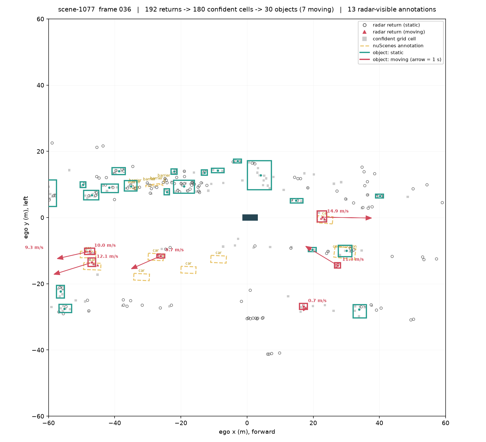
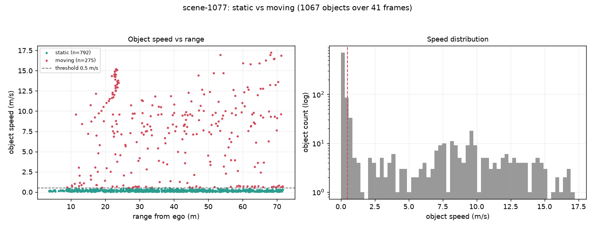

# Radar Occupancy Grid (Stage 1)

Turning sparse, noisy automotive radar into stable objects that are correctly
labelled **static or moving** — by accumulating evidence into a persistent
bird's-eye grid instead of clustering each sweep on its own.

Built on the nuScenes mini split, as the first stage of a sensor-fusion
pipeline. Stage 1 is the only part implemented; multi-sensor alignment and BEV
fusion come later.



Amber dashed = nuScenes annotations. Hollow circles = stationary radar returns,
red triangles = moving ones. Grey squares = confident grid cells. Teal boxes =
static objects, red boxes = moving, with arrows showing one second of travel.

---

## Start here

**The whole algorithm in one table.** A single grid cell, watched over 12
frames. Every hit pushes its confidence up, every miss pulls it down, and it
becomes usable once it has 2 hits and P >= 0.60:

```
frame  hits  log-odds  P(exists)   what happened
    0     1     0.847      0.700   HIT  (+0.847)
    1     1     0.442      0.609   miss (-0.405)
    2     1     0.036      0.509   miss (-0.405)
    3     1    -0.369      0.409   miss (-0.405)     <- fading; 2 more misses and it is deleted
    4     2     0.478      0.617   HIT  (+0.847)     <- passes the filter
    5     3     1.325      0.790   HIT  (+0.847)
    7     4     1.767      0.854   HIT  (+0.847)
    8     5     2.615      0.932   HIT  (+0.847)     <- now strongly believed
   11     5     1.398      0.802   miss (-0.405)     <- decays, but survives on past evidence
```

That is the core idea. Everything else is bookkeeping around it.

**Where one frame goes** (scene-0061, frame 19):

```
1-3. load + transform radar returns .......  235 points
4.   live cells in the grid ...............  686 cells    <- accumulated over 20 frames
5.   cells passing hits AND P(exists) .....  231 cells
6-7. DBSCAN -> objects ....................   42 objects
```

**Reading order.** Follow one frame through the code:

| # | read | what it does |
|---|---|---|
| 1 | [`run.py:127`](run.py#L127) `run_scene` | the whole loop in ~20 lines — read this first |
| 2 | [`radar/ingest.py:148`](radar/ingest.py#L148) `load_frame` | 5 radars → one point set in ego + global frames |
| 3 | [`radar/grid.py:184`](radar/grid.py#L184) `update` | the 5 steps of a grid update, in order |
| 4 | [`radar/grid.py:254`](radar/grid.py#L254) `_apply_hits` | where confidence goes **up** and means are updated |
| 5 | [`radar/grid.py:289`](radar/grid.py#L289) `_apply_misses` | where it goes **down** |
| 6 | [`radar/grid.py:328`](radar/grid.py#L328) `snapshot` | the filter: which cells are allowed out |
| 7 | [`radar/detect.py:95`](radar/detect.py#L95) `cluster_cells` | DBSCAN over cells, not points |
| 8 | [`radar/detect.py:162`](radar/detect.py#L162) `build_objects` | position from the grid, **velocity from this frame** |

Two functions exist only to handle motion, and they are the easiest to confuse:
[`_advect`](radar/grid.py#L228) moves cells that belong to *moving objects*;
[`_reanchor`](radar/grid.py#L202) only runs with `--anchor ego` and drags the
whole grid along with the *vehicle*.

## The problem

One radar keyframe gives **~190 points spread over a 120 m square**, and any
single return's velocity or RCS is unreliable on its own. Cluster that directly
and you are grouping a handful of unconfirmed points and believing all of them.

## The idea

Drop every return into a 1 m grid cell, and let each cell remember what it has
seen across frames: a hit count, running means of RCS / height / velocity, and a
**probability that something is really there**. Clutter fails to repeat and
decays away; real structure repeats and climbs. Only cells that are confident
*and* persistent get clustered into objects.

The cost is latency: a stationary object needs two frames (0.5 s at 2 Hz) before
it can clear the filter, so frame 0 always produces nothing. That trade — half a
second of delay in exchange for evidence instead of guesswork — is the whole bet.

It pays off measurably. Tracing one frame's annotations through the pipeline:

| | median distance to nearest annotation | within 4 m |
|---|---|---|
| raw radar returns | 1.30 m | 75.9% |
| **accumulated grid cells** | **1.12 m** | **88.5%** |

The grid localises *better* than the returns it is built from.

## The pipeline

```
run.py
  └── radar/ingest.py   1-3. load 5 radars, sensor -> ego -> global
      radar/grid.py     4.   accumulate: hits, decay, aging, P(existence)
      radar/detect.py   5-7. filter -> DBSCAN over cells -> objects
      radar/viz.py           one BEV figure per frame
```

### Existence probability: the exact rule

A **log-odds binary Bayes filter**. Each cell holds one number
`l = log(p / (1-p))`, updated once per frame:

```
hit          (>=1 return in the cell):      l <- min(l + 0.847, +4.0)
miss         (no return, cell within 60 m): l <- max(l - 0.405, -2.0)
out of range (cell beyond 60 m):            l unchanged
```

`+0.847 = log(0.70/0.30)` and `-0.405 = log(0.40/0.60)`. Cells start at `p = 0.5`
(`l = 0`); readout is `p = 1 - 1/(1 + e^l)`, bounded to [0.119, 0.982].

Three deliberate choices:

- **Log-odds, not probability** — evidence combines by addition, and `p` can
  never hit exactly 0 or 1 and get stuck.
- **`|l_hit| > |l_miss|`** — a radar miss is weak evidence (occlusion, bad
  aspect angle, a low-RCS moment); a hit is strong.
- **The +4.0 clamp is load-bearing.** Without it a wall seen for fifty frames
  would need fifty frames of misses to forget, long after leaving view. The
  clamp bounds how much history a cell can hoard, so it stays revisable.

A cell is deleted after 6 frames (3 s) without a hit, below `l = -1.5`, or once
it leaves the window.

### Two kinds of motion, both compensated

These are easy to confuse, and both are needed:

**Ego motion** — cells are keyed in the **global map frame**, so a parked car
keeps the same cell index however the ego drives. Compensation happens in the
point transform, not by sliding an array. Turning it off collapses cell reuse:
1.26–1.70x fewer cells reach 2 hits.

**Object motion** — a car at 10 m/s crosses five cells between keyframes, never
revisits one, and would never be detected. So every moving cell is advected to
`center + v·dt` before each update. The benefit scales with speed exactly as
physics demands:

| object speed | advected error | not compensated | gain |
|---|---|---|---|
| 0–2 m/s | 5.06 m | 4.99 m | −1% |
| 2–5 m/s | 1.97 m | 2.43 m | 19% |
| 5–10 m/s | 1.28 m | 4.13 m | **69%** |
| >10 m/s | 1.38 m | 6.50 m | **79%** |

Slow movers show nothing because at 1 m/s an object moves 0.5 m per frame —
below radar's sparsity floor, so it is unresolvable, not broken.

### Filtering: moving cells get a lower bar

A cell reaches clustering only if `hit_count >= required` **and**
`p_exist >= 0.60`, where `required` is **2 for static cells but 1 for moving
ones**. This asymmetry is the most important number in the code — requiring two
hits of movers too drops moving-car coverage from 50% to 17%.

It is justified, not convenient: a mover is structurally harder to observe twice
in one place, and a coherent ego-compensated velocity is *itself* corroborating
evidence, since clutter does not produce a consistent speed over ground.

### Clustering and objects

DBSCAN runs over **confident cells, not raw points** — that is what the grid
buys. `min_samples=1` is unusual and deliberate: with 2, isolated confident
cells are discarded as noise, costing ~20 points of coverage. Radar is sparse
enough that a cell which already cleared both bars is real evidence. Stationary
and moving cells are clustered separately so a passing car does not merge with
the parked row beside it and average to a standstill.

Each object then draws from two different sources, on purpose:

| property | source |
|---|---|
| position, extent, RCS, confidence | the **accumulated** grid |
| **velocity** | the **current frame** only |

A running-mean velocity lags reality and would report a vehicle as still moving
several frames after it stops — and braking is exactly when that matters most.

## Results

Three scenes, 121 keyframes, ~0.17 s/frame:

| | scene-0061 | scene-0757 | scene-1077 |
|---|---|---|---|
| objects / frame | 36.9 | 30.0 | 26.0 |
| **mean speed, moving objects** | **3.78 m/s** | **3.68 m/s** | **7.63 m/s** |
| **mean speed, static objects** | **0.09 m/s** | **0.05 m/s** | **0.16 m/s** |
| annotations covered (within 4 m) | 66.1% | 61.8% | 56.1% |
| **static/dynamic call correct** | **87.0%** | **91.2%** | **96.4%** |



The separation is bimodal with a clean gap at the threshold. In scene-1077
frame 36, every static object sits below 0.42 m/s and every mover above
0.66 m/s — and the static ones carry 20–40 hits at confidence 0.87–0.95 while
movers ride on 2–4 cells at 0.66–0.81. Persistence comes from the grid;
velocity comes from the current frame.

### Honest limitations

- **This is not a detection benchmark.** The annotation comparison is
  nearest-centroid proximity with a 4 m gate — no IoU, no confidence sweep, no
  nuScenes eval protocol. Do not compare these numbers to published results.
- **Pedestrians are found but not correctly called moving** (~1.6 radar returns
  each at walking pace). Two-wheelers are missed outright. Not a clustering bug
  — it is what a 2 Hz, low-return sensor gives on small, slow, low-RCS targets,
  and exactly why radar is a *supporting* sensor for static/dynamic
  discrimination rather than a primary detector.
- **Object count is not calibrated.** 26–37 objects/frame against 9–20
  radar-visible annotations. Much of the surplus is real structure nuScenes does
  not annotate (walls, fences, barriers), but how much is unannotated structure
  versus clutter is not measured.
- **Parameters were tuned on the scenes they are reported on.** No held-out set.
- **No tracking.** Objects have no identity across frames; persistence lives at
  the cell level only.
- **Advection assumes constant velocity** over the 0.5 s gap — a turning or
  braking vehicle violates it, and there is no uncertainty model.

### Simplified vs a production system

**Ego pose is taken straight from the keyframe — no SLERP interpolation.**
nuScenes keyframes are time-synchronised across sensors, so the pose at a
sweep's timestamp *is* the right pose. A production system with asynchronous
radar and lidar does not get this: the sweep lands between odometry samples and
its pose must be interpolated (spherical-linear on the rotation, linear on the
translation). At 15 m/s a 20 ms timing error is 0.3 m — enough to smear an
object across cells and attack the accumulation this design depends on. It is
absent here only because the dataset removes the need, and it is the first thing
to build for live sensors.

Also: the miss update is not a ray-cast free-space model (radar's angular
resolution makes the region in front of a return unreliable, so free space is
never marked free, only un-reinforced); height is collapsed to 2D; and no map or
road-geometry prior is used to suppress off-road clutter.

## Running it

nuScenes mini (~4 GB) is not included — download from
[nuscenes.org](https://www.nuscenes.org/nuscenes#download) and unpack so that
`v1.0-mini/` sits in the repo root, containing `samples/`, `sweeps/`, `maps/`
and the `v1.0-mini/` metadata folder. Or point elsewhere with `--dataroot` /
`NUSCENES_DATAROOT`.

```bash
python -m venv .venv
.venv/Scripts/python -m pip install -r requirements.txt
.venv/Scripts/python -m pip install --no-deps nuscenes-devkit
```

`nuscenes-devkit` is installed with `--no-deps` on purpose: its pinned
dependencies drag in `pycocotools`, which needs a C toolchain on Windows and is
never imported on the radar path.

```bash
python run.py --list-scenes
python run.py --scenes scene-0061 scene-0757 scene-1077
python run.py --scenes scene-1077 --viz-every 0      # no figures, faster
python run.py --scenes scene-1077 --no-advection     # see movers disappear
python run.py --scenes scene-1077 --anchor ego       # vehicle-centred grid
```

### A note on `--anchor ego`

Cells can be keyed to the map (default) or to the vehicle. I expected the
vehicle-centred version to be clearly worse, since re-keying rounds every cell
to the nearest square every frame. Measured over six scenes, it is not: moving
coverage is identical, motion calls are within a point, and only accumulation
depth suffers (2.26 → 1.93 mean hits per cell). It is a weak preference, kept as
an option.

If what you want is a fixed-shape vehicle-centred tensor for a BEV network, you
do not need it either — `RadarOccupancyGrid.to_ego_tensor()` rasterises the live
grid into a `(5, 120, 120)` float32 array (`p_exist, rcs, vx, vy, hit_count`)
from either anchor, without giving up exact accumulation.

## Data

nuScenes mini split (v1.0-mini). Caesar et al., *nuScenes: A multimodal dataset
for autonomous driving*, CVPR 2020.
