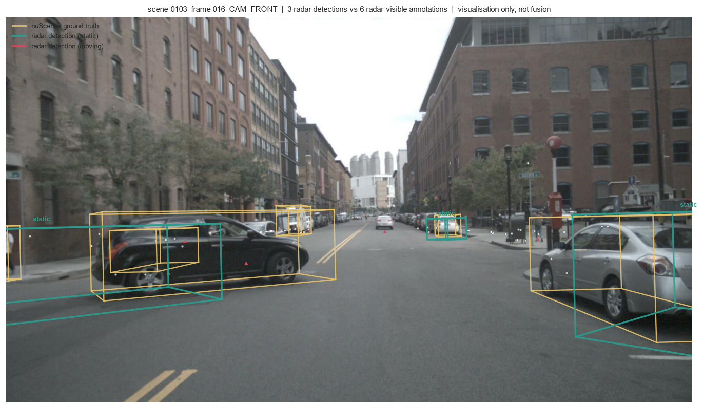
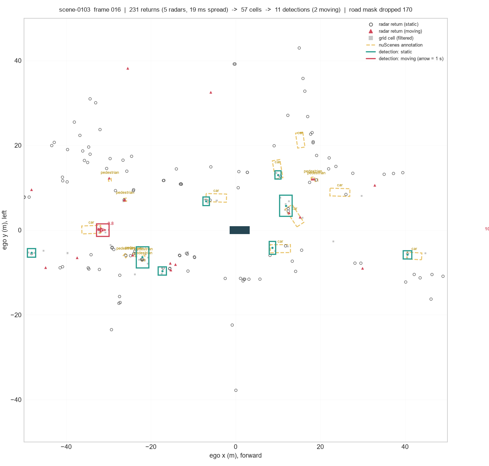

# Radar Occupancy Grid

Object detection from automotive radar on nuScenes, without machine learning.

Five radars are time-synchronised into one point cloud, accumulated over frames
into a bird's-eye occupancy grid where each cell holds a probability that
something is really there, then clustered into 3D boxes and scored with the
official nuScenes `DetectionEval`.

---

### Detections vs ground truth, in the camera



Amber is nuScenes ground truth, teal is what the radar found. The boxes land on
the right vehicles but are larger and offset — radar locates to about 1.4 m and
measures neither height nor orientation, so those are filled with constants.

### The same frame, bird's-eye



Grey squares are accumulated grid cells, amber dashed are annotations, teal and
red are detections (red = moving, arrow = one second of travel).

---

## Results

Detection quality on `mini_val`, measured against the ground truth radar can
physically see, with classification ignored:

| match distance | precision | recall | F1 | position error |
|---|---|---|---|---|
| 2.0 m | 46.4% | 29.5% | 36.1% | 1.39 m |
| **4.0 m** | **58.8%** | **37.4%** | **45.7%** | 1.63 m |

It finds about a third of visible objects, and is right about 60% of the time
when it reports one. Velocity error is **0.20 m/s** — Doppler is what radar
measures well.

On the full official benchmark: **mAP 0.0034, NDS 0.0158, car AP 0.0342.** That
is low almost entirely because radar carries no semantic information — it cannot
tell a car from a pedestrian from a fence, so every detection is labelled `car`
and nine of ten classes score zero by construction. Removing classification from
the same nuScenes scoring code raises AP to **0.071**, a 20× difference.

Other limits worth knowing: box height and orientation are constants, not
measurements; pedestrians are found but their motion is rarely right; there is
no tracking; and with only 10 mini scenes there is no true held-out set.

## Run it

nuScenes mini goes in `v1.0-mini/` at the repo root, with the map expansion pack
unpacked into `v1.0-mini/maps/expansion/`.

```bash
python -m venv .venv
.venv/Scripts/python -m pip install -r requirements.txt
.venv/Scripts/python -m pip install --no-deps nuscenes-devkit

python scripts/run_stage1.py --verify   # coordinate + timing checks
python scripts/run_stage1.py            # full pipeline + official eval
python eval/run_detection_only_eval.py  # detection judged without classification
```

```
scripts/run_stage1.py
 └── radar/ingest.py          load 5 radars
     radar/sync.py            SLERP ego-pose interpolation per radar timestamp
     radar/transform.py       sensor → ego → global
     radar/road_mask.py       drop cells off the drivable area
     radar/occupancy_grid.py  accumulate: hits, decay, aging, P(existence)
     radar/cluster.py         DBSCAN over cells
     radar/objects.py         clusters → nuScenes-format boxes
```

How it works and why each parameter is what it is:
[docs/stage1_radar_grid.md](docs/stage1_radar_grid.md).

Data: nuScenes. Caesar et al., *nuScenes: A multimodal dataset for autonomous
driving*, CVPR 2020.
